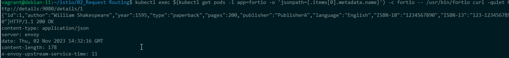
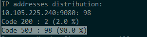

# Request Routing

Istio requires knowledge of endpoint locations and service associations to direct traffic in a mesh. It connects to a service discovery system, automatically detecting services and endpoints. Envoy proxies utilize this service registry to route traffic to the relevant services. They employ a least requests model for load balancing across service instances to ensure equitable distribution of requests.

While Istio's basic service discovery and load balancing provide a functional service mesh, it offers more advanced capabilities. Users can have finer control over traffic, such as directing a specific percentage to a new service version for A/B testing, applying custom load balancing policies, and configuring rules for incoming or outgoing mesh traffic. External dependencies can also be added to the service registry. These configurations are made possible through Istio's traffic management API, specified using Kubernetes custom resource definitions (CRDs) in YAML format.

## Virtual service
Using a virtual service, you have the ability to define traffic behavior for one or multiple hostnames. Within the virtual service, you employ routing rules to instruct Envoy on how to direct traffic from the virtual service to its intended destinations. These destinations can encompass various versions of the same service or even completely distinct services.


```
apiVersion: networking.istio.io/v1alpha3
kind: VirtualService
metadata:
  name: reviews
spec:
  hosts:
  - reviews
  http:
  - match:
    - headers:
        end-user:
          exact: jason
    route:
    - destination:
        host: reviews
        subset: v2
  - route:
    - destination:
        host: reviews
        subset: v3
```

We have:
- hosts - addressable destination or destinations that these routing rules apply to. It can be an IP address, a DNS name, wildcar

- Routing rules - virtual service’s routing rules, describing <b>match conditions</b> and <b>actions</b>. Predence - sequential (second condition there is no match)

We can also specify a weight without a match.

```
spec:
  hosts:
  - reviews
  http:
  - route:
    - destination:
        host: reviews
        subset: v1
      weight: 75
    - destination:
        host: reviews
        subset: v2
      weight: 25
```

## Services with different version

```
curl -s https://raw.githubusercontent.com/istio/istio/1.19.3/samples/bookinfo/platform/kube/bookinfo.yaml | sed 's/app: reviews/app: reviews_test/' | kubectl apply -l app=reviews_test,version=v2 -f -


```


### Get the IP of the pod and test the new service in "isolation"

```
REVIEWS_V2_POD_IP=$(kubectl get pod -l app=reviews_test,version=v2 -o jsonpath='{.items[0].status.podIP}')

echo $REVIEWS_V2_POD_IP

kubectl exec $(kubectl get pod -l app=sleep -o jsonpath='{.items[0].metadata.name}') -- curl -sS "$REVIEWS_V2_POD_IP:9080/reviews/7"
```

### Deploy a version with the right label so that it gets selected by round-robin

```
kubectl label pods -l version=v2 app=reviews --overwrite
```


Rollback v2 in case of problem

```
kubectl delete deployment reviews-v2
kubectl delete pod -l app=reviews,version=v2
```


### Weight routing

You can think of virtual services as how you route your traffic to a given destination, and then you use destination rules to configure what happens to traffic for that destination. Destination rules are applied after virtual service routing rules are evaluated, so they apply to the traffic’s “real” destination.

Virtual service defines the subset and the weight

Destination Rule associate a subset to a label


```
apiVersion: networking.istio.io/v1alpha3
kind: VirtualService
metadata:
  name: reviews
spec:
  hosts:
  - reviews
  http:
  - route:
    - destination:
        host: reviews
        subset: v1
      weight: 90
    - destination:
        host: reviews
        subset: v2
      weight: 10
---
apiVersion: networking.istio.io/v1alpha3
kind: DestinationRule
metadata:
  name: reviews
spec:
  host: reviews
  subsets:
  - name: v1
    labels:
      version: v1
  - name: v2
    labels:
      version: v2
```

Test by refreshing multiple times. Update the weight percentages

Remove the weight routing with:

```
kubectl delete -f virtual-service-weight.yaml
```

### Circuit Breaking

It provides for creating resilient microservice-based applications. In a circuit breaker, you set limits for calls to individual hosts within a service, such as the number of concurrent connections or how many times calls to this host have failed.


```


```

Test the application - all good

Simulate traffic with the following:

```
kubectl apply -f https://raw.githubusercontent.com/istio/istio/release-1.19/samples/httpbin/sample-client/fortio-deploy.yaml

kubectl exec $(kubectl get pods -l app=fortio -o 'jsonpath={.items[0].metadata.name}') -c fortio -- /usr/bin/fortio curl -quiet http://details:9080/details/1
```
All good with just 1 request



Let's now call the service with 4 concurrent connections (-c 4) and send 40 requests (-n 40):

```
kubectl exec $(kubectl get pods -l app=fortio -o 'jsonpath={.items[0].metadata.name}') -c fortio -- /usr/bin/fortio load -c 4 -qps 0 -n 40 -loglevel Warning http://details:9080/details/1
```



