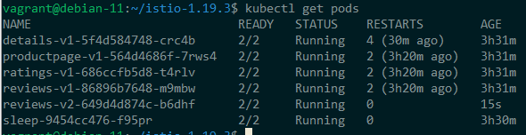
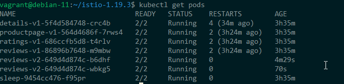

# Request Routing

For example, we might choose to launch several iterations of a microservice, such as the shipping-service, and intend to direct only a minor fraction of requests towards the fresh release.


```
curl -s https://raw.githubusercontent.com/istio/istio/1.19.3/samples/bookinfo/platform/kube/bookinfo.yaml | sed 's/app: reviews/app: reviews_test/' | kubectl apply -l app=reviews_test,version=v2 -f -


```


## Get the IP of the pod and test the new service in "isolation"

```
REVIEWS_V2_POD_IP=$(kubectl get pod -l app=reviews_test,version=v2 -o jsonpath='{.items[0].status.podIP}')

echo $REVIEWS_V2_POD_IP

kubectl exec $(kubectl get pod -l app=sleep -o jsonpath='{.items[0].metadata.name}') -- curl -sS "$REVIEWS_V2_POD_IP:9080/reviews/7"
```

## Deploy a version with the right label so that it gets selected by round-robin

```
kubectl label pods -l version=v2 app=reviews --overwrite
```



## Rollback v2 in case of problem

```
kubectl delete deployment reviews-v2
kubectl delete pod -l app=reviews,version=v2
```


