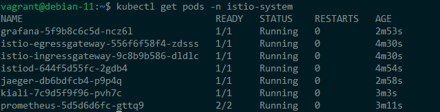

# Istio - service mesh
Sample project to test Istio - service mesh

The Service Mesh is an architectural layer responsible for ensuring the reliable delivery of requests within a complex network of microservices. As applications transition from monolithic to microservice architectures, managing and monitoring them daily can become challenging. To address these challenges, various solutions are employed to handle tasks like load balancing, service discovery, failure recovery, metrics, and monitoring. Additionally, more advanced issues are tackled, including A/B testing, canary rollouts, access control, and end-to-end authentication

<b>Istio Components:</b>

- Envoy: A high-performance proxy developed in C++ that manages all incoming and outgoing traffic for all services.

- Mixer: Manages access control and usage policies for the service network and collects telemetry data from the Envoy proxy server and other services.

- Pilot: Offers service discovery for the Envoy sidecar, enabling intelligent traffic routing (e.g., A/B tests, canary deployments) and providing fault tolerance (timeouts, retries, circuit breakers).

- Citadel: Ensures reliable service-to-service and end-user authentication.

- Galley: Handles Istio configuration validation and acts as a barrier between Istio's other components and the user configuration of the underlying platform.


# Prerequisite

A K8s cluster - you can use Minikube or MicroK8s. Follow the instructions here https://istio.io/v1.7/docs/setup/platform-setup/

## Minikube

Start minikube with hypervisor driver and create the namespace

```
minikube config set driver kvm2
# eventually you will need to remove the existing minikube profile
minikube start --memory=12384 --cpus=4
export NAMESPACE=tutorial
kubectl create namespace $NAMESPACE
```


## Install Istio addons

Demo profile - configuration designed to showcase Istio functionality with modest resource requirements

```
export PATH="$PATH:/home/vagrant/istio-1.19.3/bin"
istioctl install --set profile=demo -y
kubectl label namespace $NAMESPACE istio-injection=enabled

kubectl apply -f https://raw.githubusercontent.com/istio/istio/1.19.3/samples/addons/prometheus.yaml
kubectl apply -f https://raw.githubusercontent.com/istio/istio/1.19.3/samples/addons/loki.yaml
kubectl apply -f https://raw.githubusercontent.com/istio/istio/1.19.3/samples/addons/kiali.yaml
kubectl apply -f https://raw.githubusercontent.com/istio/istio/1.19.3/samples/addons/jaeger.yaml
kubectl apply -f https://raw.githubusercontent.com/istio/istio/1.19.3/samples/addons/grafana.yaml

```

Check that Istio PODs are OK in istio-system

```
kubectl get pods -n istio-system
```


## Install the Bookinfo

Bookinfo is a sample microservice application with different tech stacks

```
# set the default namespace
kubectl config set-context minikube --namespace=$NAMESPACE

# export MYHOST environment variable to hold the URL of the application 
export MYHOST=$(kubectl config view -o jsonpath={.contexts..namespace}).bookinfo.com

kubectl apply -l version!=v2,version!=v3 -f https://raw.githubusercontent.com/istio/istio/1.19.3/samples/bookinfo/platform/kube/bookinfo.yaml
```
Check that the PODs are initializing


When all ok, deploy a testing pod, sleep, to use for sending requests to your microservices:

```
# Scale to 3 replicas each
kubectl scale deployments --all --replicas 3

kubectl get pods

kubectl apply -f https://raw.githubusercontent.com/istio/istio/1.19.3/samples/sleep/sleep.yaml

kubectl exec $(kubectl get pod -l app=sleep -o jsonpath='{.items[0].metadata.name}') -c sleep -- curl -sS productpage:9080/productpage | grep -o "<title>.*</title>"

```

Apply an ingress controller

```
kubectl apply -f https://raw.githubusercontent.com/istio/istio/1.19.3/samples/bookinfo/networking/bookinfo-gateway.yaml

# in a new terminal window to start a Minikube tunnel that sends traffic to your Istio Ingress Gateway. This will provide an external load balancer

minikube tunnel

export INGRESS_HOST=$(kubectl -n istio-system get service istio-ingressgateway -o jsonpath='{.status.loadBalancer.ingress[0].ip}')

export INGRESS_PORT=$(kubectl -n istio-system get service istio-ingressgateway -o jsonpath='{.spec.ports[?(@.name=="http2")].port}')

export SECURE_INGRESS_PORT=$(kubectl -n istio-system get service istio-ingressgateway -o jsonpath='{.spec.ports[?(@.name=="https")].port}')

export GATEWAY_URL=$INGRESS_HOST:$INGRESS_PORT

# ensure that you get the HTML from
curl http://$GATEWAY_URL/productpage
```

Now we need to port forward the Ingress to the external HOST

```
kubectl get pods -n istio-system

# look for the istio-ingressgateway
kubectl port-forward pod/istio-ingressgateway-9c8b9b586-25n52 8080 -n istio-system
```

## Istio 

Istio seamlessly integrates with various telemetry tools, which offer valuable insights into your service mesh's architecture, visualize the mesh's structure, and assess the overall health of your mesh.


```
#launch kiali dashboard
istioctl dashboard kiali

#simulate traffic
for i in $(seq 1 100); do curl -s -o /dev/null "http://$GATEWAY_URL/productpage"; done
```


